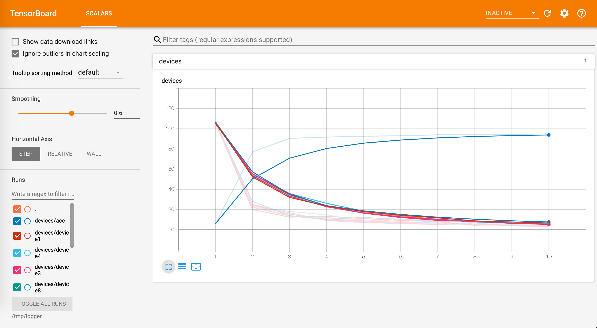
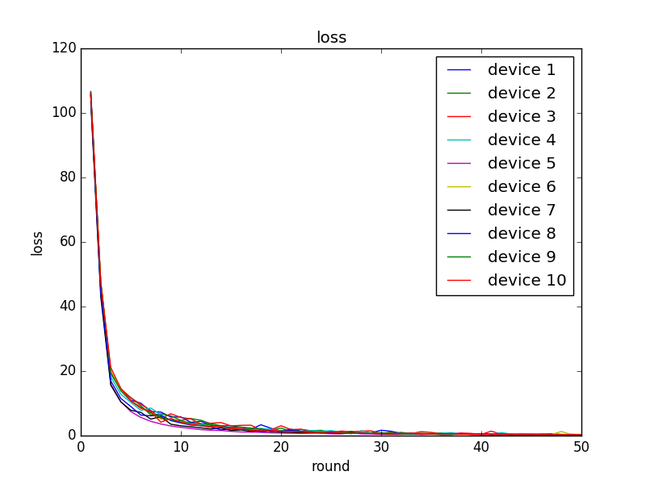
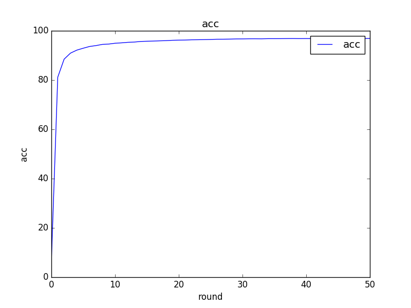

## kubeFL

<p align="center"></img></p>

kubefl is short for kubernetes with [Federated Learning](https://arxiv.org/abs/1610.05492) Simulator, a project that helps you handle Federated Learning in a Kubernetes infra environment. Like [Towards Federated Learning at Scale: System Design Paper(K Bonawitz et al)](https://arxiv.org/abs/1902.01046), The cycle is based on rounds, and each round consists of a **Client, Worker Aggregator, and Master Aggregator**.

- `Client` : All client nodes are assumed to be the same as the mobile device environment with ec2 nodes. Each mobile node learns the model with data assuming that each mobile device produces it and uploads it to the worker aggregator.
- `Worker Aggregator` : Worker Aggregator takes the learned model from client and sends it to master aggregator. We used LoadBalancer to avoid large traffic.
- `Master Aggregator` : Master Aggregator takes a model from Worker Aggregator and creates a new version model through Algorithm called [Federated AVG](https://ai.googleblog.com/2017/04/federated-learning-collaborative.html) and uploads it to S3. The uploaded model is used as the initial model for the next round.


**You can use our infra on Kubernetes or Bare Metal environment.**

### Prepare Setting Both(k8s or Bare Metal environment Both)

- You need Full Access AWS key and install terraform, ansible, eksctl, kubectl

  ```shell
  # set aws access key
  $ export AWS_ACCESS_KEY_ID=''
  $ export AWS_SECRET_ACCESS_KEY=''
  ```

- Upload initial model to S3 as public.

- **Set number of Node, instance type or Subnet-id, etc** in  `client/terraform/variables.tf`, Then provisioning Client Nodes.

  ```shell
  $ cd client/terraform
  $ terraform init && terraform apply
  ```

- Scratter datas(In here we use MNIST) to all client nodes

   ```shell
  $ python data_splitter.py [-h] [--n_label N_LABEL] --bucket_name <BUCKET_NAME>
                        --bucket_key <BUCKET_KEY> [--key_path KEY_PATH]
                        [--saved_dir SAVED_DIR] [--init_model INIT_MODEL]
                        [--n_data N_DATA]
  ```

- Initializing all client nodes with Ansible.

  ```shell
  $ ./init.sh
  ```


## Federated Learning on Bare Metal

- Provisioning Worker Aggregator(ec2 + elb) and initialization python packagement such as flask.

  ```shell
  $ cd ../worker_aggregator
  $ cd terraform
  $ terraform init && terraform apply
  
  $ cd ../ansible
  $ ./init.sh
  
  # run all worker aggregators.
  $ ./worker.sh [upload server url]
  ```

- Master Aggregator Setup

  ```shell
  # enter to master aggregator node
  $ wget https://raw.githubusercontent.com/sortteam/kubeFL/master/master_aggregator/init.sh | bash
  $ python master.py \
    --bucket_name=[s3 bucket name] \
    --bucket_key=[s3 bucket key] \
    --web_model=[model download url] \
    --threshold=10
  ```

- Now, Start Federated Learning will be started 

  ```shell
  # run train.sh in local
  $ cd client/ansible
  $ ./train.sh \
      --round 1 \
      --server [elb A recode DNS] \
      --epoch 10 \
      --model [model download url]
  ```


## Federated Learning on Kubernetes Cluster

- Start EKS Kubernetes Cluster with eksctl

  ```shell
  $ eksctl create cluster kubefl \
      --node-type=m5.large \
      --timeout=40m \
      --nodes=2 \
      --region=ap-northeast-2
  ```

- Start aggregators

  ```shell
  $ cd ../master_aggregator
  
  PUT_ACCESS_KEY_HERE=''
  PUT_SECRET_KEY_HERE=''
  
  $ cat master.yaml | sed "s/{{AWS_ACCESS_KEY_ID}}/$PUT_ACCESS_KEY_HERE/g" | sed "s/{{AWS_SECRET_ACCESS_KEY}}/$PUT_SECRET_KEY_HERE/g" | kubectl apply -f -
  ```

  

## Visualization

You can see all devices at a glance with Tensorboard.




Also if you want to see accuracy, run `evalute.py` and use `python showgraph.py —show_acc`.

```shell
# evalute accuracy
$ python evalute.py --maxlen 10

# show graph
$ python showgraph.py --show_loss
$ python showgraph.py --show_acc
```

<p align="center"></img></img></p>

## LICENSE

This project is a [SoRT team](https://github.com/sortteam) project in [SW Maestro](https://blog.naver.com/sw_maestro) 10th. We are considering a license.

Copyright &copy; 2019 [SoRT team](https://blog.naver.com/sw_maestro)

